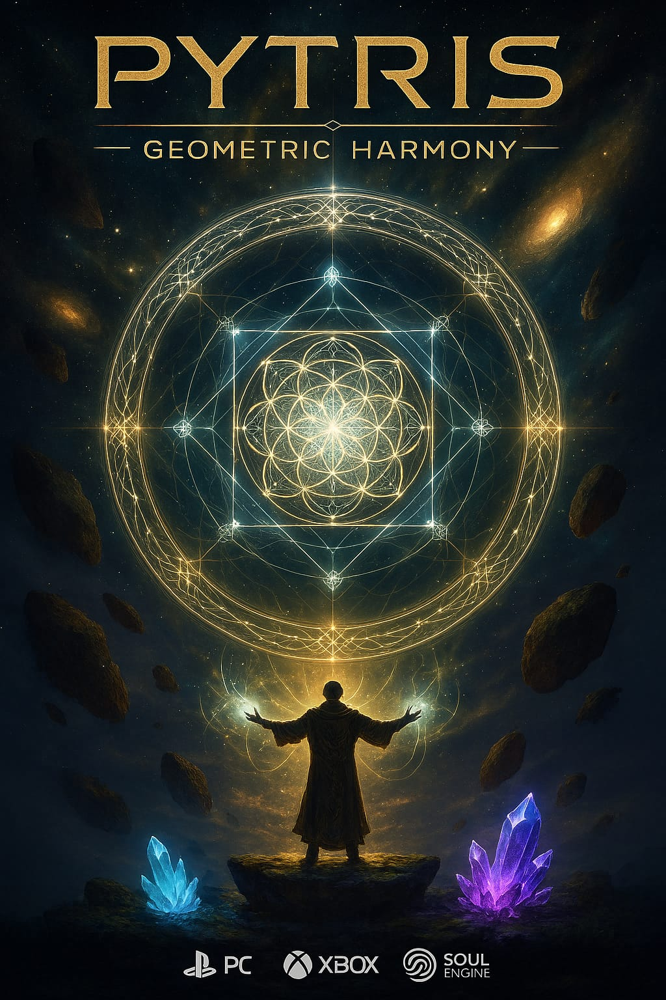

# Pytris Geometric Harmony

## La Leyenda de la Armonía Perdida

### Prólogo: El Reino de la Geometría Perfecta

En los tiempos ancestrales, existía **Geometria**, un reino donde reinaba la perfecta armonía matemática. Cada forma tenía su lugar, cada ángulo su propósito, y cada línea su destino. Los polígonos danzaban en perfecta sincronía, creando patrones infinitos de belleza absoluta.

Pero un día, **Chaos**, la fuerza primordial de la entropía, despertó de su letargo milenario. Celoso de la perfecta armonía que no podía comprender, desató su poder destructivo sobre Geometria, fragmentando las formas perfectas en **tetrominós errantes** y sumiendo el reino en el desorden absoluto.

### El Llamado del Dios de la Armonía

**Tú eres Pythagoras**, el Dios de la Armonía Geométrica, último guardián del orden matemático. Tu esencia se ha fragmentado junto con el reino, pero tu poder aún persiste. Solo tú puedes restaurar el equilibrio perdido.

El campo de juego representa **el Plano Primordial**, el lienzo donde se escriben las leyes fundamentales de la geometría. Cada tetromino que cae es un **fragmento de armonía perdida**, una pieza de la perfección original que busca su lugar en el gran diseño.

### La Mecánica de la Restauración

**Cada línea completada** es un **Acorde Geométrico Perfecto** - un momento donde las formas encuentran su lugar destinado y la armonía se restaura parcialmente. Cuando las piezas se alinean perfectamente, emiten una **Resonancia Pitagórica**, una vibración que debilita el poder de Chaos.

**Las líneas múltiples** representan **Sinfonías de Orden**:
- **Línea Simple**: Un susurro de armonía
- **Doble**: Un acorde mayor de esperanza  
- **Triple**: Una melodía de restauración
- **Tetris**: ¡Un crescendo de poder divino!

### La Batalla Contra la Entropía

A medida que avanzas, **Chaos** se enfurece. Los tetrominós caen más rápido, representando su desesperación por mantener el desorden. Pero cada línea que completas fortalece tu poder divino y devuelve un fragmento de belleza al mundo.

**El puntaje** representa tu **Índice de Armonía Cósmica** - cuanta más perfección restaures, más poderoso te vuelves.

### Los Niveles de Iluminación Geométrica

Cada nivel representa una **Esfera de Comprensión** diferente:

1. **El Plano de los Cuadrados** - Donde aprendes los fundamentos
2. **El Reino de los Rectángulos** - Expandiendo tu comprensión
3. **La Dimensión de las Formas Complejas** - Dominando patrones avanzados
4. **El Sanctum de la Geometría Sagrada** - Donde solo los verdaderos maestros pueden sobrevivir

### La Victoria Final

Cuando logres resistir lo suficiente y acumular suficiente armonía, **Pythagoras** recuperará su poder completo. En ese momento, un **Pulso de Armonía Universal** se expandirá por todo Geometria, devolviendo cada forma a su lugar perfecto y sellando a Chaos en las profundidades del vacío matemático.

### Elementos Narrativos Durante el Juego

**Mensajes de Armonía** que aparecen al hacer líneas:
- Línea simple: "Un fragmento encuentra su hogar..."
- Doble: "La resonancia se intensifica..."
- Triple: "¡Las fuerzas se alinean!"
- Tetris: "¡ARMONÍA PERFECTA RESTAURADA!"

**Estados de Chaos** según la altura de las piezas:
- Campo bajo: "La armonía prevalece..."
- Campo medio: "Chaos susurra en las sombras..."
- Campo alto: "¡La entropía amenaza el equilibrio!"
- Casi Game Over: "¡EL REINO TAMBALEA!"

### La Filosofía Subyacente

*Pytris Geometric Harmony* no es solo un juego - es una **meditación interactiva** sobre el eterno conflicto entre orden y caos, una exploración lúdica de cómo la belleza emerge del aparente desorden cuando aplicamos principios matemáticos universales.

Cada partida es un **ritual de creación**, donde el jugador asume el papel de arquitecto cósmico, construyendo armonía una línea a la vez, demostrando que incluso en el caos más absoluto, la geometría perfecta puede encontrar su camino hacia la luz.

---

*"En la perfecta alineación de las formas, reside el secreto de la armonía universal."*  
**- Los Axiomas de Pythagoras**
